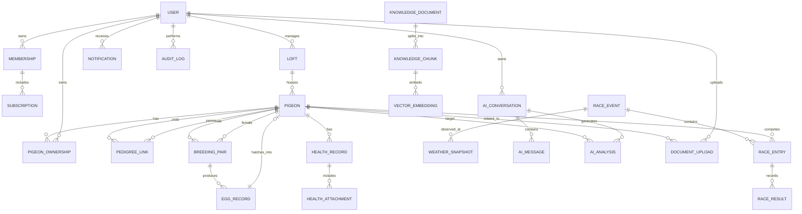

# Pigeon AI Entity Relationship Design

## 1. Purpose

This Phase 1 ERD document defines the logical data model for Pigeon AI. It is not a Prisma schema and does not include migrations. Physical schema, migrations, seed data, indexes, constraints, audit tables, and soft-delete implementation will be delivered in Phase 2.

## 2. Core Data Rule

Ring Number is the unique identity of every pigeon.

- `pigeon.ring_number` is globally unique.
- Every pigeon-related business table must reference `ring_number` directly or through a strongly related parent that directly references it.
- Ring Number appears in APIs, search, imports, AI analysis, race records, health records, pedigree records, and notifications.
- Ring Number changes are exceptional and must be audited as identity corrections, not ordinary edits.

## 3. Logical ERD

## 4. Entity Catalog

### 4.1 Identity and Membership

| Entity | Key Fields | Notes |
| --- | --- | --- |
| `User` | `id`, `phone`, `email`, `display_name`, `locale`, `status` | Breeder, admin, support, veterinarian/advisor role-ready |
| `AuthIdentity` | `id`, `user_id`, `provider`, `provider_subject` | Supports password, phone OTP, OAuth, future LINE login |
| `Session` | `id`, `user_id`, `refresh_token_hash`, `expires_at`, `device_id` | Rotating refresh tokens |
| `Membership` | `id`, `user_id`, `plan_code`, `status`, `starts_at`, `ends_at` | Entitlements for module access and AI quota |
| `Subscription` | `id`, `membership_id`, `provider`, `provider_ref`, `billing_status` | Provider-neutral abstraction |
| `Entitlement` | `id`, `membership_id`, `feature_code`, `limit_value` | AI quota, pigeon limit, storage limit |

### 4.2 Loft and Pigeon Registry

| Entity | Key Fields | Ring Number Link | Notes |
| --- | --- | --- | --- |
| `Loft` | `id`, `owner_user_id`, `name`, `location`, `timezone` | Indirect through Pigeon | Breeder-managed loft |
| `Pigeon` | `ring_number`, `loft_id`, `name`, `sex`, `color`, `birth_date`, `status` | Primary | Ring Number is primary domain identity |
| `PigeonOwnership` | `id`, `ring_number`, `user_id`, `ownership_type`, `starts_at`, `ends_at` | Direct | Handles transfers and co-ownership |
| `PigeonPhoto` | `id`, `ring_number`, `s3_key`, `photo_type` | Direct | Supports AI vision and records |
| `PigeonMeasurement` | `id`, `ring_number`, `weight`, `wing_length`, `measured_at` | Direct | Optional structured performance/health data |

### 4.3 Pedigree

| Entity | Key Fields | Ring Number Link | Notes |
| --- | --- | --- | --- |
| `PedigreeLink` | `id`, `child_ring_number`, `parent_ring_number`, `parent_role` | Direct x2 | Parent role: sire/dam/unknown |
| `PedigreeImport` | `id`, `uploaded_by`, `source_file_id`, `status` | Via imported rows | Tracks PDF/Excel/image import batches |
| `PedigreeImportRow` | `id`, `import_id`, `ring_number`, `raw_payload`, `validation_status` | Direct | Supports OCR/import correction |

### 4.4 Breeding

| Entity | Key Fields | Ring Number Link | Notes |
| --- | --- | --- | --- |
| `BreedingPair` | `id`, `male_ring_number`, `female_ring_number`, `season`, `status` | Direct x2 | Pairing and recommendation target |
| `EggRecord` | `id`, `pair_id`, `egg_no`, `laid_at`, `hatched_at`, `offspring_ring_number` | Via pair/direct offspring | Offspring may be assigned after hatch |
| `BreedingNote` | `id`, `pair_id`, `ring_number`, `note`, `created_by` | Direct optional | Allows bird-specific notes |

### 4.5 Health

| Entity | Key Fields | Ring Number Link | Notes |
| --- | --- | --- | --- |
| `HealthRecord` | `id`, `ring_number`, `record_type`, `symptoms`, `diagnosis`, `treatment`, `recorded_at` | Direct | Veterinary disclaimer required for AI |
| `VaccinationRecord` | `id`, `ring_number`, `vaccine_name`, `administered_at`, `next_due_at` | Direct | Notification source |
| `MedicationRecord` | `id`, `ring_number`, `medicine_name`, `dosage`, `starts_at`, `ends_at` | Direct | Safety-sensitive |
| `HealthAttachment` | `id`, `health_record_id`, `ring_number`, `s3_key`, `media_type` | Direct | Images/docs/audio |

### 4.6 Racing and Weather

| Entity | Key Fields | Ring Number Link | Notes |
| --- | --- | --- | --- |
| `RaceEvent` | `id`, `name`, `club`, `release_location`, `release_at`, `distance_km` | Indirect | Event-level data |
| `RaceEntry` | `id`, `race_event_id`, `ring_number`, `handler_user_id`, `status` | Direct | One pigeon per event entry |
| `RaceResult` | `id`, `race_entry_id`, `ring_number`, `arrival_at`, `rank`, `speed` | Direct | Denormalized ring number for query speed/audit |
| `TrainingFlight` | `id`, `ring_number`, `start_location`, `distance_km`, `duration` | Direct | Race prediction input |
| `WeatherSnapshot` | `id`, `race_event_id`, `location`, `observed_at`, `wind`, `temperature`, `humidity` | Indirect/direct optional | Weather center and prediction feature |
| `WeatherAlert` | `id`, `user_id`, `ring_number`, `alert_type`, `triggered_at` | Direct optional | Bird-specific or loft/race alert |

### 4.7 Knowledge and AI

| Entity | Key Fields | Ring Number Link | Notes |
| --- | --- | --- | --- |
| `KnowledgeDocument` | `id`, `title`, `category`, `language`, `s3_key`, `status` | Optional | Admin-managed and user-uploaded docs |
| `KnowledgeChunk` | `id`, `document_id`, `chunk_index`, `content`, `metadata` | Optional | RAG source granularity |
| `VectorEmbedding` | `id`, `chunk_id`, `embedding`, `model`, `dimensions` | Optional | PGVector physical design in Phase 2 |
| `AiConversation` | `id`, `user_id`, `locale`, `channel`, `started_at` | Optional | Chat and voice sessions |
| `AiMessage` | `id`, `conversation_id`, `role`, `content`, `media_refs`, `token_usage` | Optional | Redaction and retention policy applies |
| `AiAnalysis` | `id`, `ring_number`, `analysis_type`, `input_refs`, `output_summary`, `confidence`, `model_version` | Direct | Pedigree/health/breeding/race outputs |
| `DocumentUpload` | `id`, `user_id`, `ring_number`, `s3_key`, `file_type`, `processing_status` | Direct optional | PDF, Excel, image, audio uploads |
| `OcrResult` | `id`, `upload_id`, `ring_number`, `raw_text`, `structured_json`, `confidence` | Direct optional | Imported facts require user confirmation |

### 4.8 Notifications, Audit, and Operations

| Entity | Key Fields | Notes |
| --- | --- | --- |
| `Notification` | `id`, `user_id`, `ring_number`, `type`, `title`, `body`, `status` | Ring-aware where relevant |
| `NotificationDelivery` | `id`, `notification_id`, `channel`, `provider_ref`, `status` | Push/email/SMS/in-app |
| `AuditLog` | `id`, `actor_user_id`, `action`, `entity_type`, `entity_id`, `ring_number`, `before`, `after`, `ip` | Immutable append-only |
| `OutboxEvent` | `id`, `event_type`, `payload`, `status`, `published_at` | Future microservice/event bridge |
| `SoftDeleteMetadata` | Logical fields on mutable tables | `deleted_at`, `deleted_by`, `delete_reason` |

## 5. Ring Number Constraints

- `Pigeon.ring_number` unique, non-null, immutable except privileged correction workflow.
- Ring Number format validation should support Taiwan/local association formats and retain raw string.
- Case and punctuation normalization should be consistent for search, but original display format should be preserved.
- Foreign key references should target `Pigeon.ring_number` where feasible in Phase 2.
- Race, health, breeding, pedigree, AI analysis, document upload, and notification records should include `ring_number` for audit and fast lookup.

## 6. Audit and Soft Delete Strategy

- Mutable business entities include `created_at`, `updated_at`, `deleted_at`, `created_by`, `updated_by`, `deleted_by`.
- Security-sensitive and identity-changing operations append to `AuditLog`.
- Race results, health records, pedigree links, AI analysis outputs, payment events, and ownership transfers must be audit logged.
- Soft deletion hides records from normal queries but preserves audit/legal traceability.
- Hard deletion is restricted to retention-policy purge workflows after legal checks.

## 7. Index and Query Strategy for Phase 2

Priority indexes:

- `pigeon(ring_number)` unique
- `pigeon(loft_id, status)`
- `pigeon_ownership(user_id, ring_number, ends_at)`
- `pedigree_link(child_ring_number)` and `pedigree_link(parent_ring_number)`
- `health_record(ring_number, recorded_at desc)`
- `race_entry(ring_number, race_event_id)`
- `race_result(ring_number, arrival_at desc)`
- `ai_analysis(ring_number, analysis_type, created_at desc)`
- `notification(user_id, status, created_at desc)`
- `audit_log(entity_type, entity_id, created_at desc)` and `audit_log(ring_number, created_at desc)`
- PGVector index on `vector_embedding.embedding`

## 8. Data Lifecycle

1. User creates account and membership.
2. User creates a loft.
3. User registers pigeons by Ring Number.
4. User adds pedigree, breeding, health, training, race, and uploads.
5. AI service analyzes user-approved data.
6. Admin curates knowledge base and monitors platform health.
7. Audit log preserves sensitive changes and recommendations.

## 9. Acceptance Criteria

- Ring Number is the primary logical identity for pigeons.
- All pigeon-related domains directly or indirectly reference Ring Number.
- ERD covers all requested core modules.
- Audit, soft delete, indexes, constraints, and PGVector considerations are documented for Phase 2.
- No Prisma schema or migration code is generated in Phase 1.
