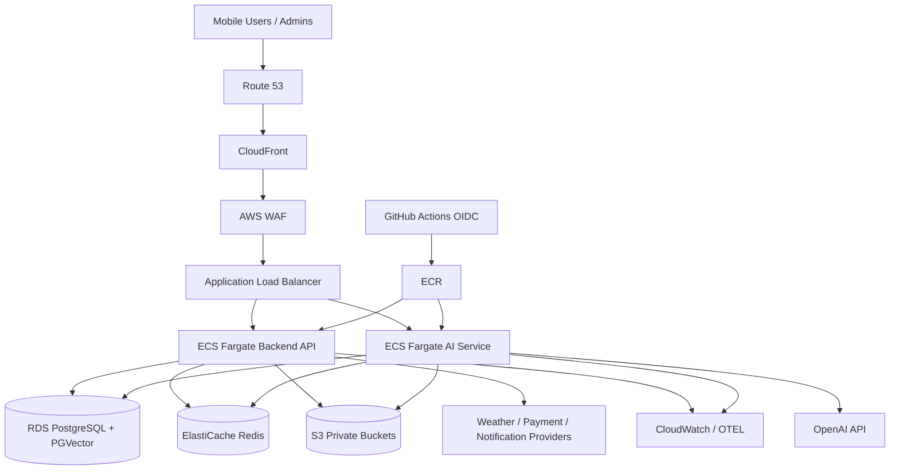

# Pigeon AI Infrastructure Architecture

## 1. Purpose

This Phase 1 document defines the target AWS infrastructure architecture for Pigeon AI. Terraform, Docker, GitHub Actions, monitoring configuration, and deployment code are deferred to Phase 7.

## 2. Target Environments

| Environment | Purpose | Data |
| --- | --- | --- |
| `dev` | Developer integration | Synthetic only |
| `staging` | Release validation/UAT | Masked or synthetic |
| `production` | Live customer traffic | Production data |

## 3. AWS Reference Architecture

## 4. Compute

Recommended initial platform:

- ECS Fargate for backend API and AI service containers.
- Separate task definitions and autoscaling policies for API, worker, scheduler, and AI service roles.
- Web admin static assets hosted through S3 + CloudFront or deployed as containerized SSR if framework requires it.

Future migration:

- EKS can be introduced if service count, traffic patterns, or platform team maturity justify Kubernetes.
- Domain modules can split into microservices behind the same API gateway/ALB.

## 5. Networking

- One VPC per environment.
- At least two Availability Zones for staging/production.
- Public subnets: ALB, NAT gateways.
- Private application subnets: ECS services/workers.
- Private data subnets: RDS and ElastiCache.
- VPC endpoints for S3, ECR, CloudWatch, and Secrets Manager where cost/benefit is approved.
- No public IPs on application or database workloads.

## 6. Data Services

### 6.1 PostgreSQL

- Amazon RDS PostgreSQL with Multi-AZ in production.
- PGVector extension for semantic search.
- Automated backups and PITR.
- Read replica roadmap for analytics/read-heavy workloads.

### 6.2 Redis

- ElastiCache Redis for cache, queues, rate limiting, and ephemeral sessions.
- Production should use Multi-AZ replication group.

### 6.3 Object Storage

S3 buckets:

- `uploads`: user photos, audio, PDF, Excel
- `knowledge`: curated knowledge base documents
- `exports`: generated reports
- `backups`: logical exports and DR artifacts
- `admin-static`: admin portal static hosting if needed

All private objects require signed URLs and SSE-KMS.

## 7. CI/CD

Phase 7 GitHub Actions should implement:

1. Pull request checks: lint, typecheck, test, build, security scan.
2. Container build: backend, AI service, admin if containerized.
3. Image push to ECR with immutable tags.
4. Terraform plan on pull requests.
5. Terraform apply after approval for staging/production.
6. Blue/green or rolling ECS deployment.
7. Smoke tests after deploy.
8. Automatic rollback on health check failure where feasible.

GitHub Actions should use OIDC federation to AWS, not static AWS access keys.

## 8. Observability

### 8.1 Logs

- Structured JSON logs.
- Correlation IDs from edge to backend to AI service.
- PII redaction.
- Centralized CloudWatch Logs with retention by environment.

### 8.2 Metrics

Core metrics:

- API request count, latency, and error rate
- Auth failures and suspicious login patterns
- Database CPU, connections, locks, slow queries
- Redis memory and queue depth
- AI latency, token usage, error rate, refusal/safety rate
- OCR/import success/failure rate
- Notification delivery success/failure rate
- Subscription webhook failures

### 8.3 Tracing

OpenTelemetry traces across:

- Mobile/web request correlation
- Backend API
- Database and Redis
- AI service
- External providers
- Async jobs

## 9. Backup and Disaster Recovery

| Component | Backup Strategy | Recovery Target |
| --- | --- | --- |
| RDS PostgreSQL | Automated backups + PITR + snapshots | RPO <= 15 min, RTO <= 4 hr |
| S3 | Versioning + lifecycle + cross-region option | RPO <= 24 hr initially |
| Redis | Snapshot where queue/session data requires it | Best effort for cache; queues recover from outbox where possible |
| Secrets | Managed by AWS; versioned rotation | Restore via Terraform/secrets process |
| Terraform state | Remote encrypted backend with locking | Recover infrastructure definitions |

DR drills should be performed before enterprise production launch and at least twice yearly after launch.

## 10. Scalability Plan

- Horizontal ECS autoscaling by CPU, memory, request count, and queue depth.
- AI and OCR workloads run asynchronously to protect API latency.
- Cache read-heavy reference data such as plans, categories, and weather snapshots.
- Use pagination and Ring Number indexes for pigeon timelines and race histories.
- Read replicas and analytics pipelines can be added after usage patterns emerge.

## 11. Cost Controls

- AI usage quotas by membership entitlement.
- Per-file upload limits and lifecycle transitions to lower-cost S3 storage.
- Autoscaling min/max per environment.
- CloudWatch retention tuned by environment.
- Scheduled non-production scale-down if acceptable.

## 12. Infrastructure Acceptance Criteria

- AWS target topology covers compute, data, storage, network, secrets, monitoring, CI/CD, backup, and DR.
- Production workloads are private and highly available.
- Terraform/Docker/GitHub Actions implementation is deferred to Phase 7.
- Architecture supports future microservice migration.

## 13. Architecture Notes

- The recommended starting point is ECS Fargate because it is production-ready while avoiding early Kubernetes operational overhead.
- The architecture remains microservice-ready through separate task roles, service boundaries, structured logs, explicit APIs, and independent autoscaling targets.
- Redis must not become the sole durable store for business facts; PostgreSQL remains the source of truth.
- Terraform and Docker implementation artifacts are intentionally deferred to Phase 7.
