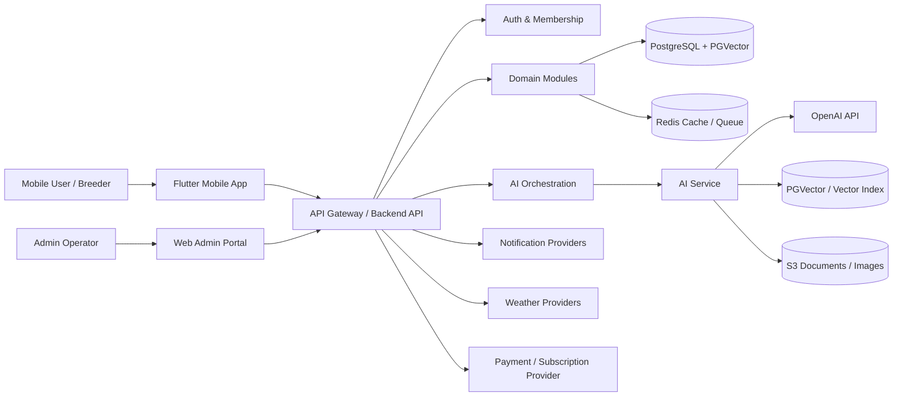

# Pigeon AI Software Architecture Document (SAD)

## 1. Purpose

Pigeon AI（和平鴿智慧體）is an enterprise AI platform for Taiwan racing pigeon breeders. This Phase 1 document defines the target production architecture for Android, iOS, and Web Admin without generating application source code.

## 2. Scope

Phase 1 covers architecture only:

- Authentication and membership
- Loft, pigeon, pedigree, breeding, health, race, weather, knowledge, AI assistant, subscription, and notification domains
- Mobile app, web admin, backend API, AI service, database, infrastructure, security, and operations
- Future microservice migration readiness

Phase 1 intentionally excludes application implementation, Prisma schema, migrations, runnable app code, and deployment code.

## 3. Business Context

### 3.1 Primary Users

Taiwan racing pigeon breeders, generally age 40-80+, who need low-friction workflows, Traditional Chinese UI, large touch targets, voice-friendly interaction, and clear domain terminology.

### 3.2 Domain Principle

Ring Number is the unique identity of every pigeon. Every business entity that relates to a pigeon must connect through `ring_number` either directly or through an entity that directly references it.

### 3.3 Key Success Criteria

- Buildable and testable in later phases
- Runs on Android and iOS
- Deployable on AWS
- Supports production traffic and auditability
- Supports future decomposition into microservices
- Supports Traditional Chinese, Mandarin, and Taiwanese Hokkien AI interactions

## 4. Architecture Goals

| Goal | Decision |
| --- | --- |
| Senior-friendly UX | Large fonts, simplified navigation, voice input, Traditional Chinese-first copy |
| Enterprise readiness | Layered architecture, RBAC, audit trails, observability, backups, DR |
| Domain consistency | Ring Number-centric data model and API design |
| AI extensibility | Dedicated AI service with multimodal adapters, RAG, prompt/version governance |
| Migration flexibility | Modular monolith first, bounded contexts, event-driven seams |
| Regulatory safety | Privacy-by-design, consent, encryption, least privilege, retention controls |

## 5. System Context

## 6. Logical Architecture

### 6.1 Clients

- **Flutter Mobile App**: Android and iOS app using Riverpod, GoRouter, Clean Architecture, offline-aware UX, accessibility defaults, and voice-friendly flows.
- **Web Admin Portal**: Admin-facing app for user management, knowledge management, race management, analytics, monitoring, subscriptions, and support operations.

### 6.2 Backend API

NestJS modular monolith in Phase 3, structured by bounded contexts:

- `AuthModule`
- `MembershipModule`
- `UserModule`
- `LoftModule`
- `PigeonModule`
- `PedigreeModule`
- `BreedingModule`
- `HealthModule`
- `RaceModule`
- `WeatherModule`
- `KnowledgeModule`
- `AiGatewayModule`
- `SubscriptionModule`
- `NotificationModule`
- `AuditModule`
- `AdminModule`

The modular monolith will publish domain events internally and use explicit module contracts so high-volume contexts can later migrate to independent services.

### 6.3 AI Service

A dedicated AI service owns:

- Chat orchestration
- Voice transcription and speech interaction
- Vision and OCR workflows
- PDF/Excel ingestion
- Retrieval augmented generation (RAG)
- Pedigree analysis
- Breeding recommendation
- Health analysis
- Race prediction
- Prompt, model, and evaluation governance

OpenAI integration should use modern multimodal APIs for text/image/audio reasoning, Realtime where low-latency voice is required, embeddings for semantic search, and vector stores or PGVector-backed retrieval depending on data residency and operational needs. OpenAI official documentation describes the Responses API as supporting text and image inputs, stateful interactions, tools, and function calling; Realtime supports low-latency multimodal voice interactions; embeddings convert text to vectors for search and recommendation; and file search/vector stores support retrieval over uploaded knowledge documents.

### 6.4 Data Platform

- PostgreSQL is the system of record.
- PGVector supports semantic search and AI retrieval.
- Redis supports cache, rate limiting, ephemeral sessions, and job queues.
- S3 stores images, documents, exports, audio, and OCR artifacts.
- All pigeon-related facts are linked to Ring Number.

### 6.5 Integration Platform

External integrations:

- OpenAI API for GPT, vision, audio, embeddings, and AI tools
- Weather providers for race/weather center
- Push notification services for Android/iOS
- Email/SMS/LINE-compatible notification providers if approved in later phases
- Subscription/payment providers selected in a later business decision
- AWS services for compute, storage, logs, secrets, monitoring, and backups

## 7. Deployment Architecture

Initial production deployment target:

- AWS VPC across at least two Availability Zones
- Public ALB/API Gateway edge
- Private ECS Fargate or EKS workloads for backend and AI service
- RDS PostgreSQL with Multi-AZ
- ElastiCache Redis
- S3 for object storage
- CloudFront for admin static assets and media delivery
- AWS Secrets Manager / Parameter Store
- CloudWatch, X-Ray/OpenTelemetry, and alerting
- WAF and Shield protections at the edge

## 8. Bounded Contexts

| Context | Responsibility | Migration Candidate |
| --- | --- | --- |
| Identity | Login, JWT, refresh tokens, RBAC, sessions | Yes |
| Membership | plans, entitlements, subscriptions | Yes |
| Pigeon Registry | Ring Number, profile, loft ownership | High |
| Pedigree | ancestry graph and lineage analysis | High |
| Breeding | pairings, eggs, hatch, offspring | Medium |
| Health | visits, vaccines, symptoms, treatment | Medium |
| Racing | races, training, results, predictions | High |
| Weather | weather aggregation and alerts | Medium |
| Knowledge | documents, categories, search metadata | High |
| AI | multimodal AI workflows and RAG | High |
| Notification | push/email/SMS/in-app events | Medium |
| Admin | operational management and analytics | Low |
| Audit | immutable event/audit log | Medium |

## 9. Cross-Cutting Concerns

### 9.1 Security

- JWT access tokens with rotating refresh tokens
- MFA-ready admin login
- RBAC and future ABAC support
- Tenant-aware authorization
- Audit logging for sensitive operations
- Encryption in transit and at rest
- Secrets in managed secret store only
- Signed object URLs for uploads/downloads
- Malware scanning for uploaded documents where feasible
- AI prompt injection and data exfiltration controls

### 9.2 Observability

- Structured JSON logs with correlation IDs
- OpenTelemetry traces across API, AI service, database, Redis, and queues
- Metrics for latency, errors, saturation, AI token usage, retrieval quality, OCR success, queue depth, and notification delivery
- Alerts for SLO breach, auth anomalies, payment failures, AI provider errors, database saturation, and backup failures

### 9.3 Resilience

- Idempotent write APIs where retries are expected
- Queue-based processing for uploads, OCR, AI analysis, notifications, and imports
- Circuit breakers for OpenAI, weather, notification, and payment providers
- Graceful degradation for AI and weather outages
- Retry with exponential backoff and dead-letter queues

### 9.4 Internationalization and Accessibility

- Traditional Chinese default locale (`zh-Hant-TW`)
- Domain language adapted to Taiwan racing pigeon culture
- Voice input paths for text-heavy flows
- Minimum 18sp equivalent body text for senior-friendly UX, larger for primary actions
- High contrast, large tap targets, and simple screen hierarchy

## 10. AI Architecture Principles

1. **Human-in-the-loop**: AI provides recommendations, not medical or guaranteed race outcomes.
2. **Grounded responses**: Knowledge answers must cite retrieved sources when possible.
3. **Model abstraction**: Backend stores logical AI capability names, not hard-coded model assumptions in business logic.
4. **Prompt governance**: Prompts are versioned, tested, and reviewed before production release.
5. **Safety filters**: AI avoids definitive veterinary diagnosis and escalates urgent health conditions to professional consultation.
6. **Privacy controls**: User data and uploaded files are scoped by tenant/user and retention policy.
7. **Evaluation**: Regression suites cover Traditional Chinese, Mandarin, Taiwanese Hokkien transcription, domain terminology, and hallucination checks.

## 11. Event Architecture

Initial implementation uses internal domain events; future phases can map them to SNS/SQS, EventBridge, Kafka, or another broker.

Key events:

- `user.registered`
- `membership.updated`
- `loft.created`
- `pigeon.registered`
- `pigeon.transferred`
- `pedigree.updated`
- `breeding.pairing_created`
- `health.record_created`
- `race.result_imported`
- `weather.alert_triggered`
- `knowledge.document_ingested`
- `ai.analysis_completed`
- `notification.delivery_failed`
- `audit.security_event_recorded`

## 12. Non-Functional Requirements

| Category | Target |
| --- | --- |
| Availability | 99.5% initial target, 99.9% roadmap for paid enterprise tiers |
| API latency | p95 < 500ms for cached reads; p95 < 1.5s for normal writes excluding AI jobs |
| AI latency | Async for long analysis; realtime voice optimized for low-latency sessions |
| Scalability | Horizontal API scaling; async queues for heavy jobs |
| Recovery | RPO <= 15 minutes, RTO <= 4 hours initial production target |
| Accessibility | Senior-friendly WCAG AA-aligned visual design |
| Test coverage | 80%+ target in QA phase |
| Audit retention | Configurable by policy, default 7 years for critical business/audit records |

## 13. Module Acceptance Criteria

- Each module has documented responsibilities and ownership boundaries.
- Every pigeon-related module references Ring Number.
- API contracts are represented in OpenAPI documentation.
- Security controls are traceable to threat mitigations.
- Infrastructure decisions include production, backup, monitoring, and DR considerations.
- UI flows are Traditional Chinese-first and senior-friendly.
- AI flows include safety, privacy, and evaluation controls.

## 14. Phase 1 Review Checklist

- [ ] Architecture approved for Phase 2 database schema work
- [ ] Ring Number identity model approved
- [ ] Security and data retention assumptions approved
- [ ] AI provider/data-handling assumptions approved
- [ ] AWS deployment target approved
- [ ] Mobile/admin UX direction approved
- [ ] Subscription/payment provider decision captured or deferred

## 15. Open Decisions

| Decision | Options | Recommendation |
| --- | --- | --- |
| Payment provider | Apple/Google IAP, Stripe, local Taiwan payment gateway | Decide before Subscription implementation |
| Weather source | Government weather API, commercial provider, hybrid | Use hybrid abstraction |
| LINE notifications | Include in MVP or later | Later unless business confirms |
| Admin framework | React/Next.js, Vue/Nuxt, Flutter Web | Decide in Phase 6 |
| AI retrieval storage | OpenAI vector stores, PGVector, hybrid | Hybrid architecture, PGVector for first-party domain data |

## 16. Official AI Documentation References

The AI architecture should be verified against official OpenAI documentation during implementation:

- Responses API: https://platform.openai.com/docs/api-reference/responses
- Realtime API: https://platform.openai.com/docs/guides/realtime/
- Realtime WebRTC: https://platform.openai.com/docs/guides/realtime-webrtc
- Embeddings: https://platform.openai.com/docs/guides/embeddings
- Retrieval and vector stores: https://platform.openai.com/docs/guides/retrieval
- File search: https://platform.openai.com/docs/guides/tools-file-search/
