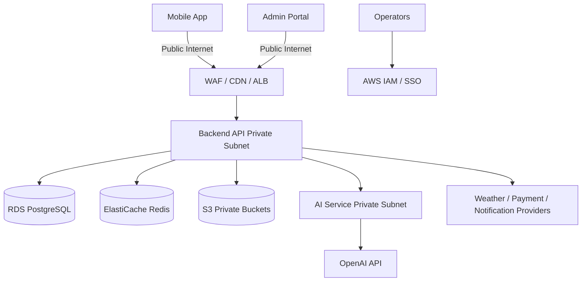

# Pigeon AI Security Architecture

## 1. Purpose

This Phase 1 document defines security architecture for Pigeon AI across mobile, web admin, backend, AI services, data, and AWS infrastructure.

## 2. Security Objectives

- Protect breeder accounts, pigeon records, race data, health data, photos, documents, and AI conversations.
- Enforce least privilege across users, admins, services, infrastructure, and AI tooling.
- Preserve auditability for Ring Number identity changes and sensitive business operations.
- Prevent unsafe AI output, prompt injection, data leakage, and unauthorized cross-tenant access.
- Support production monitoring, incident response, backup, and disaster recovery.

## 3. Trust Boundaries

## 4. Identity and Access Management

### 4.1 User Authentication

- Access tokens: short-lived JWTs.
- Refresh tokens: rotating, hashed at rest, device-bound where feasible.
- Login methods: phone/email password or OTP-ready design; OAuth/LINE-ready extension.
- Password policy: strong hashing with Argon2id or bcrypt in Phase 3.
- Session management: revoke per device and revoke all sessions.

### 4.2 Admin Authentication

- MFA required for production admin roles.
- Separate admin routes, RBAC policies, audit logging, and session timeout.
- High-risk actions require re-authentication or step-up verification.

### 4.3 Authorization

- RBAC baseline: breeder, loft manager, support, knowledge editor, admin, system.
- Resource-level authorization for loft ownership, Ring Number ownership, and membership entitlements.
- Future ABAC-ready claims: region, plan, feature entitlement, support ticket scope.
- Deny-by-default policy.

## 5. Data Protection

### 5.1 Encryption

- TLS 1.2+ externally; TLS inside service mesh/VPC where feasible.
- RDS encryption at rest.
- S3 SSE-KMS for uploads, photos, audio, documents, backups, and exports.
- Secrets stored only in AWS Secrets Manager/Parameter Store or CI secret storage.

### 5.2 Privacy and Retention

- AI conversations and uploads are scoped to user/tenant.
- Admin access to user content is audited and support-purpose limited.
- Retention policies must distinguish operational logs, audit logs, uploaded media, AI transcripts, billing records, and backups.
- User deletion requests should soft-delete application records first and purge eligible data according to retention/legal policy.

### 5.3 Sensitive Data Handling

Sensitive fields:

- Phone, email, address/location, device tokens
- Payment provider references
- Health records, photos, uploaded documents/audio
- AI conversation content
- Admin audit records and IP addresses

Controls:

- Field-level redaction in logs.
- Signed URLs for private objects.
- Malware scanning or quarantined processing for uploads where feasible.
- PII minimization in AI prompts.

## 6. AI Security

### 6.1 Threats

- Prompt injection in uploaded documents.
- Model hallucination and unsafe veterinary advice.
- Cross-user retrieval leakage.
- Sensitive data exfiltration through AI tools.
- Excessive token spend or abuse.

### 6.2 Controls

- RAG retrieval filters by tenant, document status, category, and authorization.
- AI system prompts instruct domain boundaries, Traditional Chinese output, and medical/race uncertainty disclaimers.
- Tool/function calling is allowlisted with strict schemas.
- Uploaded document instructions are treated as untrusted data.
- AI responses include confidence, source citations where available, and escalation guidance for health emergencies.
- AI rate limits and quota enforcement by membership plan.
- Prompt and model versions logged with analysis output.

## 7. Application Security

- Input validation through DTO/schema validation.
- Server-side authorization on every resource access.
- CSRF protection where cookie sessions are used; JWT bearer flows for mobile.
- CORS restricted to approved origins.
- Secure headers for admin portal.
- File upload allowlist for images, PDF, Excel, and audio.
- Size limits per file type and plan.
- Idempotency keys for payment/webhook and critical write endpoints.
- OpenAPI schema-first validation for external contracts.

## 8. Infrastructure Security

- Private subnets for API, AI service, RDS, Redis.
- Security groups with least privilege.
- No direct public database access.
- WAF managed rules, rate limits, and IP reputation lists.
- IAM roles per workload with minimal permissions.
- CI/CD OIDC federation instead of long-lived AWS keys.
- Immutable container image tags and vulnerability scanning.
- Backup encryption and restore testing.

## 9. Audit Logging

Audit events must include:

- Actor, role, IP/device, correlation ID
- Entity type/id and Ring Number where applicable
- Action and outcome
- Before/after snapshots for critical changes
- Timestamp and request metadata

Mandatory audit cases:

- Login failures and suspicious auth events
- Admin user changes
- Ring Number correction or transfer
- Pigeon ownership transfer
- Pedigree update
- Race result import/change
- Health record create/update/delete
- AI analysis generated for a Ring Number
- Subscription/payment webhook processing
- Knowledge publish/unpublish

## 10. Threat Model Summary

| Threat | Control |
| --- | --- |
| Account takeover | MFA admin, rate limits, refresh rotation, suspicious login alerts |
| Cross-tenant data access | Resource authorization, tenant-scoped queries, tests |
| Upload malware | File allowlist, quarantine, scanning, signed URLs |
| Prompt injection | Untrusted document isolation, tool allowlists, retrieval filters |
| Data exfiltration | Least privilege, logging redaction, AI prompt minimization |
| Payment tampering | Signed webhooks, idempotency, audit logs |
| Race result manipulation | RBAC, import validation, audit trails |
| Database breach | Encryption, private networking, secrets management |
| Outage/data loss | Multi-AZ, backups, DR drills |

## 11. Security Acceptance Criteria

- Authentication, authorization, data protection, AI safety, infrastructure, and audit controls are documented.
- Every sensitive Ring Number operation is auditable.
- File upload and AI workflows include explicit security controls.
- Phase 3+ implementation must include unit/integration tests for authorization boundaries.

## 12. Architecture Notes

- Security is enforced at the API/service layer even when UI hides restricted actions.
- Tenant, user, and Ring Number authorization checks must be tested as first-class acceptance criteria in later implementation phases.
- AI safety controls are part of security architecture, not optional prompt wording.
- Audit logs are separate from operational logs and must be protected from ordinary modification.
