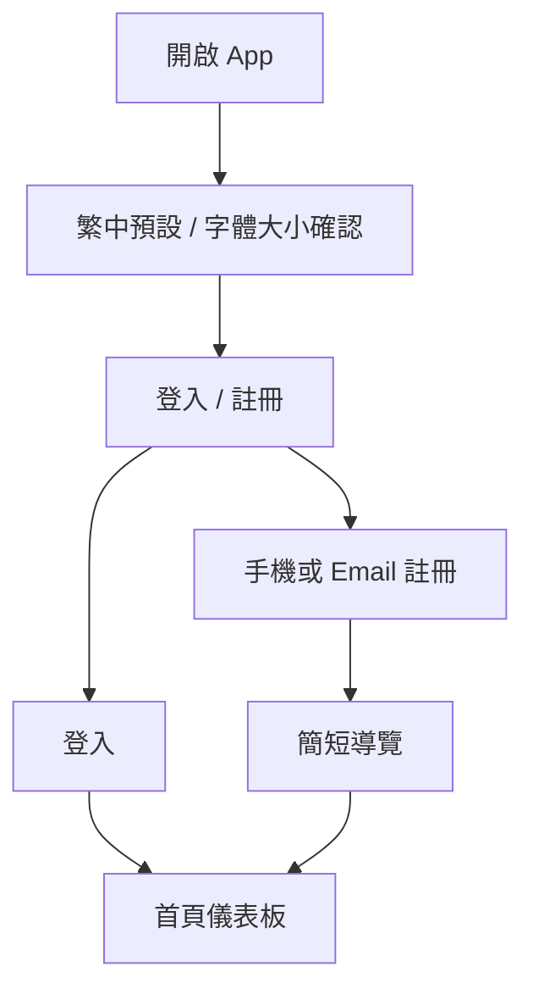
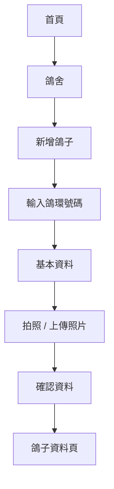
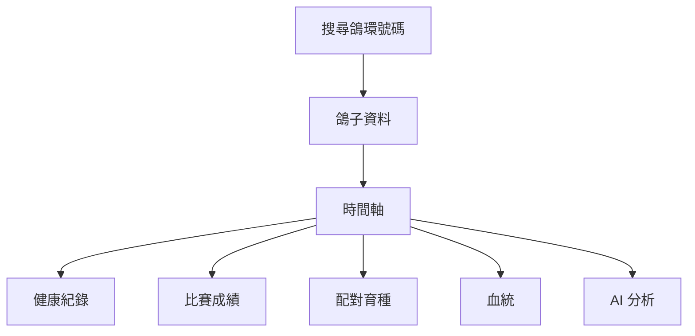
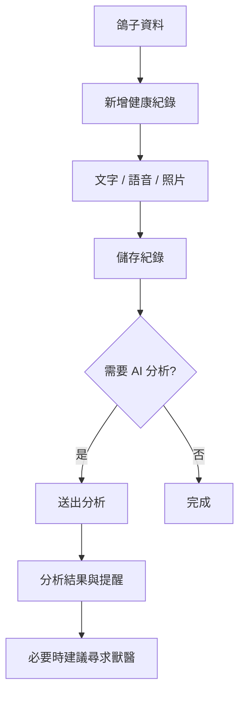
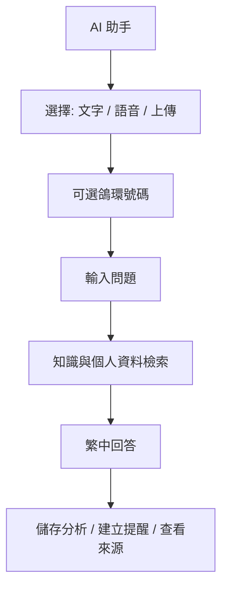
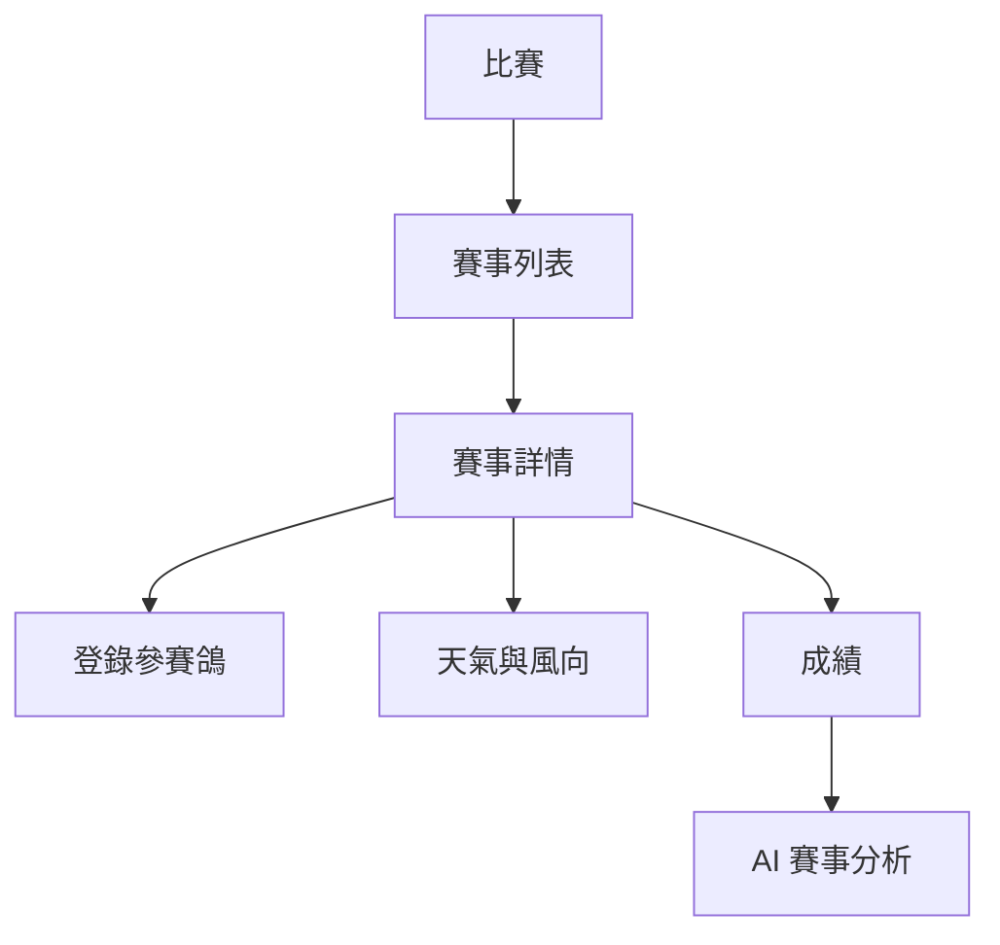
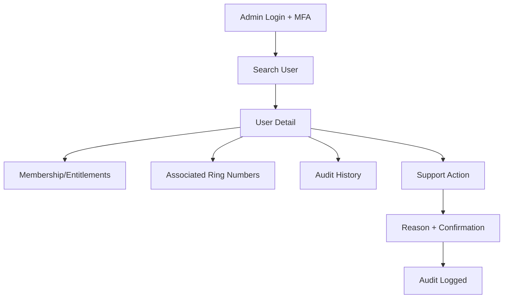
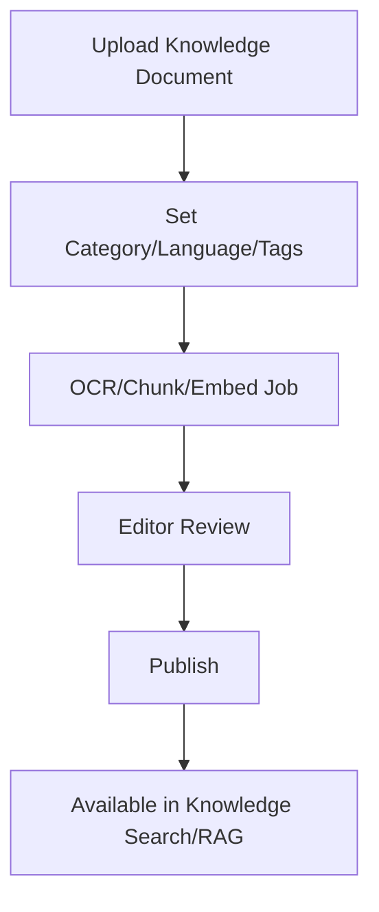
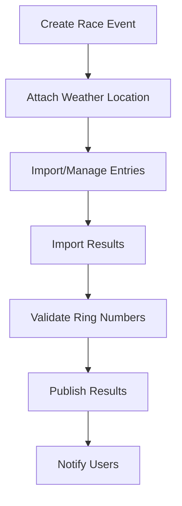

# Pigeon AI UI Flow Architecture

## 1. Purpose

This Phase 1 document defines mobile and web admin user flows for Pigeon AI. It is design architecture only and contains no Flutter or web source code.

## 2. UX Principles

Pigeon AI serves Taiwan racing pigeon breeders, many of whom are age 40-80+. The UX must prioritize clarity and low learning curve.

- Traditional Chinese first (`zh-Hant-TW`).
- Large fonts and large tap targets.
- Simple bottom navigation and clear labels.
- Voice-friendly input for notes, AI assistant, search, and health/race updates.
- Minimal form complexity per screen.
- Confirmation screens for destructive or sensitive actions.
- Ring Number-first search and lookup.
- AI assistance available contextually but never forced.

## 3. Mobile Information Architecture

Primary bottom navigation:

1. **首頁** Home
2. **鴿舍** Loft/Pigeons
3. **比賽** Race
4. **AI 助手** AI Assistant
5. **我的** Profile

Secondary feature entry cards on Home:

- 健康管理
- 配對育種
- 血統管理
- 天氣中心
- 知識庫
- 通知提醒

## 4. Mobile Primary Flows

### 4.1 First Launch and Authentication

Requirements:

- Login screen uses large fields and high contrast.
- Voice is introduced as an optional convenience.
- Onboarding should be skippable and no more than 3-4 screens.

### 4.2 Register Pigeon by Ring Number

Requirements:

- Ring Number is the first field.
- Duplicate Ring Number conflicts explain ownership/import options.
- Photo upload supports AI vision in later phases.

### 4.3 Pigeon Timeline

Requirements:

- Timeline groups records by date and category.
- Primary actions are visible: 新增健康, 新增比賽, 詢問 AI.

### 4.4 Health Record with AI Assistance

Requirements:

- AI health output must show uncertainty and veterinary escalation language.
- User can save raw record without AI.

### 4.5 AI Assistant

Requirements:

- Supports Mandarin and Taiwanese Hokkien voice input where provider capabilities permit.
- User can attach Ring Number context.
- Knowledge-based answers show sources when available.

### 4.6 Race and Weather

Requirements:

- Weather center uses simple icons and clear risk labels.
- Race result import correction must be reviewable before saving.

## 5. Mobile Accessibility Defaults

| Element | Target |
| --- | --- |
| Body font | At least 18sp equivalent |
| Primary action font | 20-24sp equivalent |
| Tap target | At least 48dp, preferably 56dp for primary buttons |
| Contrast | WCAG AA-aligned |
| Navigation depth | Common tasks within 2-3 taps |
| Forms | One major task per screen, save draft where useful |
| Voice | Microphone button visible on search, notes, AI assistant |

## 6. Web Admin Information Architecture

Admin portal top-level navigation:

1. Dashboard / Analytics
2. User Management
3. Pigeon and Loft Lookup
4. Race Management
5. Knowledge Management
6. Subscriptions
7. AI Monitoring
8. Notifications
9. System Monitoring
10. Audit Logs
11. Settings

## 7. Admin Primary Flows

### 7.1 User Support Flow

### 7.2 Knowledge Publishing Flow

### 7.3 Race Management Flow

## 8. Notification UX

Notification categories:

- Health reminders
- Vaccination due
- Race/weather alerts
- Breeding milestones
- AI analysis complete
- Subscription/billing
- System/admin messages

Users can set preferences by channel and category. Critical account/security notifications cannot be fully disabled.

## 9. UI Acceptance Criteria

- Mobile navigation fits senior-friendly usage and Traditional Chinese terminology.
- Ring Number search and profile access are central.
- Voice input paths are included for major text flows.
- Admin portal includes user, knowledge, race, analytics, monitoring, and audit flows.
- No Flutter or web source code is generated in Phase 1.

## 10. Architecture Notes

- Mobile UX prioritizes daily breeder workflows over administrative completeness.
- AI Assistant is both a primary tab and contextual action from Ring Number pages because older users benefit from visible, repeated entry points.
- Admin UX uses dense tables only where appropriate for trained operators; breeder-facing screens should remain card-based and large-format.
- Advanced pedigree visualization can be added later, but Phase 1 flows must establish Ring Number lookup and timeline navigation first.
