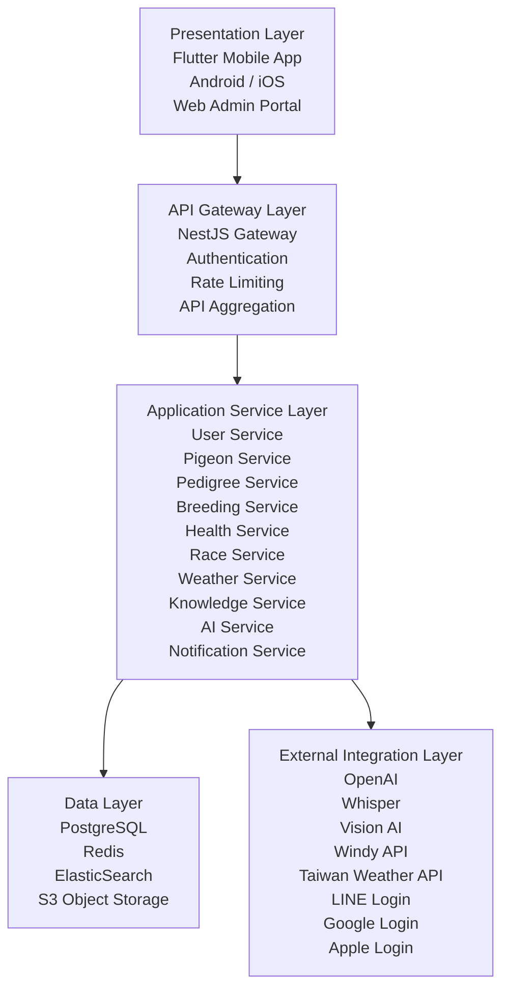
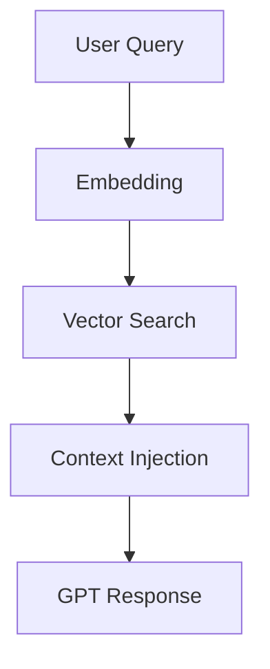

# Pigeon AI（和平鴿智慧體）System Architecture Document (SAD)

**Version:** 1.0  
**Author:** Product Management Team  
**Target Platform:** Android, iOS, Web Admin  
**Architecture Style:** Microservice + AI Native Architecture

---

## 1. System Overview

Pigeon AI 是專為台灣賽鴿產業打造之 AI 驅動智慧平台。

核心目標：建立完整賽鴿數位化生態系。

包含：

1. AI 智慧助理
2. 鴿舍管理
3. 血統分析
4. 育種推薦
5. 健康管理
6. 競翔管理
7. 即時氣象
8. 產業資訊中心

---

## 2. Architecture Layers

### Presentation Layer

- Flutter Mobile App
  - Android
  - iOS
- Web Admin Portal

### API Gateway Layer

- NestJS Gateway
- Authentication
- Rate Limiting
- API Aggregation

### Application Service Layer

- User Service
- Pigeon Service
- Pedigree Service
- Breeding Service
- Health Service
- Race Service
- Weather Service
- Knowledge Service
- AI Service
- Notification Service

### Data Layer

- PostgreSQL
- Redis
- ElasticSearch
- S3 Object Storage

### External Integration Layer

- OpenAI
- Whisper
- Vision AI
- Windy API
- Taiwan Weather API
- LINE Login
- Google Login
- Apple Login

---

## 3. AI Architecture

### AI Core

- GPT-5.x

### Modules

- AI Chat
- AI Vision
- AI OCR
- AI Pedigree Analysis
- AI Breeding Recommendation
- AI Race Prediction
- AI Health Assistant
- Knowledge RAG Engine
- Embedding Store
- Vector Database
- PGVector

### Search Pipeline

---

## 4. Security

- OAuth2
- JWT
- Refresh Token
- AES256 Encryption
- HTTPS TLS 1.3
- Database Encryption
- Object Storage Encryption
- Audit Logs
- Admin Activity Tracking

---

## 5. Scalability

- Docker
- Kubernetes
- Horizontal Scaling
- CDN
- Redis Cache
- Queue System
- RabbitMQ

---

## 6. Monitoring

- Prometheus
- Grafana
- Sentry
- OpenTelemetry

---

## 7. Disaster Recovery

- Daily Backup
- Multi-region Storage
- Recovery Time Objective (RTO): < 4 hours
- Recovery Point Objective (RPO): < 1 hour
